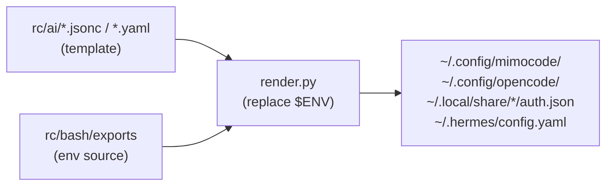

# AI Toolchain Configuration Management

## Multi-Provider Model Routing

The repository supports three AI API providers, selectable at runtime:

| Provider | Default Variable | API Endpoint | Models |
|:---------|:-----------------|:-------------|:-------|
| Provider 1 (mimo/Xiaomi) | `PROVIDER_NAME=peng-min` | `https://api.xiaomimimo.com/v1` | `mimo-v2.5`, `mimo-v2.5-pro` |
| Provider 2 (NVIDIA) | `PROVIDER_2_NAME=peng-nvidia` | `https://integrate.api.nvidia.com/v1` | Nemotron-3 variants, GPT-OSS, DeepSeek v4, etc. |
| Provider 3 (SiliconFlow) | — | `https://api.siliconflow.cn/v1` | Embedding model only (`BAAI/bge-m3`) |

The `bin/claudee` script provides an interactive 9-option menu to switch between providers and models. It sets `ANTHROPIC_BASE_URL`, `ANTHROPIC_AUTH_TOKEN`, and `ANTHROPIC_MODEL` for the current shell session.

Source: [`bin/claudee`](bin/claudee), [`rc/bash/exports`](rc/bash/exports)

## Config Rendering Pipeline

AI tool configs are stored as templates in `rc/ai/` with `${ENV}` placeholders. The installer replaces these with real values at install time.

### Rendered Targets

| Template | Deployed Location | Purpose |
|:---------|:------------------|:--------|
| `rc/ai/mimocode.jsonc` | `~/.config/mimocode/mimocode.jsonc` | mimocode IDE config |
| `rc/ai/opencode.jsonc` | `~/.config/opencode/opencode.jsonc` | OpenCode IDE config |
| `rc/ai/mimo_opencode_auth.json` | `~/.local/share/mimocode/auth.json`, `~/.local/share/opencode/auth.json` | Auth tokens |
| `rc/ai/hermes-config.yaml` | `~/.hermes/config.yaml` | Hermes agent config (merged incrementally) |

### Rendering Logic (`render.py`)

1. Loads all `export KEY=VALUE` from `rc/bash/exports`
2. For each target file, regex-replaces `${VAR}` and `$VAR` patterns with values from the loaded env
3. Writes the rendered content back to the file in-place

The hermes config uses `merge.py` instead of direct copy: it parses the `model:` section from the source YAML and merges keys into the existing destination without overwriting user-added fields.

## Global AI Rules Distribution

`install.sh` copies `global-agents.md` to seven AI tool locations:

- `~/.claude/CLAUDE.md`
- `~/.gemini/GEMINI.md`
- `~/.gemini/config/AGENTS.md`
- `~/.gemini/antigravity/AGENTS.md`
- `~/.config/opencode/AGENTS.md`
- `~/.cursor/AGENTS.md`
- `~/.copilot/copilot-instructions.md`

This ensures the AI Coding Constitution (simplicity-first, surgical changes, no defensive code) is active across all tools.

## NVIDIA API Model Verification

The `tools/nvidia_api/verify.py` script tests all configured NVIDIA models by sending a minimal chat completion request and measuring latency. It reads the API key from exports and model list from `tools/nvidia_api/config.yaml`, then outputs sorted results with copy-ready `export MODEL_2_N="..."` lines.

Source: [`tools/nvidia_api/verify.py`](tools/nvidia_api/verify.py), [`tools/nvidia_api/config.yaml`](tools/nvidia_api/config.yaml)
