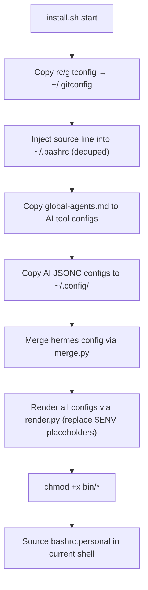

# Architecture Overview

## Shell Sourcing Chain

The entry point is `~/.bashrc`, which `install.sh` injects with a single source line (deduped on each run). On shell startup:

```
~/.bashrc
  └─ . rc/bash/bashrc.personal     (sets DOTFILES_DIR, adds bin/ to PATH)
       ├─ . rc/bash/path            (PATH construction — loaded first)
       ├─ . rc/bash/exports         (environment variables)
       ├─ . rc/bash/aliases         (shell aliases)
       └─ . rc/bash/functions       (shell functions)
       └─ [Windows only] . rc/bash/windowsrc
```

`bashrc.personal` (`rc/bash/bashrc.personal`) resolves `DOTFILES_DIR` relative to its own location, then sources the four config modules in order: path → exports → aliases → functions. On Windows (Git Bash), it additionally sources `windowsrc`.

### PATH Construction (`rc/bash/path`)

```
.:$HOME/bin:$HOME/.local/bin:$PATH    (all platforms)
$HOME/.opencode/bin:$HOME/.npm-global/bin:$HOME/.mimocode/bin:$PATH    (Linux only)
```

Platform detection uses `uname -s` because `OSTYPE` is unreliable under Git Bash.

### Exports (`rc/bash/exports`)

Defines environment variables for three AI providers (mimo/Xiaomi, NVIDIA, SiliconFlow), plus ancillary services (Kaggle, Tushare, GitHub, Cloudflare, Google Cloud). The default Claude Code configuration points to Provider 1.

### Aliases (`rc/bash/aliases`)

Categorized into: network checks, navigation, git/project shortcuts, stock analysis tools (`kline`, `cline`, `btest`), AI tools (`claude`, `anti`), SSH/remote, Zellij sessions, and utilities (`ll`, `la`, `ur` for `uv run`).

### Functions (`rc/bash/functions`)

`ccc` copies file content to clipboard (cross-platform: `clip` on Windows, `xclip` on Linux). `zm`/`kzm` manage AnyDesk service via systemctl.

## Installer Flow

`install.sh` is designed for idempotent execution — safe to run repeatedly without creating duplicates.



**Key files touched by installer**:

| Source | Destination | Method |
|:-------|:------------|:-------|
| `rc/gitconfig` | `~/.gitconfig` | Direct copy |
| `rc/bash/bashrc.personal` | Sourced from `~/.bashrc` | `grep -qF` deduped append |
| `global-agents.md` | `~/.claude/CLAUDE.md`, `~/.gemini/GEMINI.md`, etc. | `cp -f` |
| `rc/ai/mimocode.jsonc` | `~/.config/mimocode/mimocode.jsonc` | Copy then render |
| `rc/ai/opencode.jsonc` | `~/.config/opencode/opencode.jsonc` | Copy then render |
| `rc/ai/mimo_opencode_auth.json` | `~/.local/share/mimocode/auth.json`, `opencode/auth.json` | Copy then render |
| `rc/ai/hermes-config.yaml` | `~/.hermes/config.yaml` | `merge.py` (incremental) then render |

## Cross-Platform Design

The repository supports Linux, macOS, and Windows Git Bash. Key platform considerations:

- **Binary detection**: `uname -s` is used everywhere; `OSTYPE` is unreliable in Git Bash
- **Line endings**: All files must use LF; CRLF causes `\r: command not found`
- **Windows isolation**: `windowsrc` is only sourced when `$OSTYPE` matches `msys*` or `cygwin*`
- **No Windows scripts**: The AI Coding Constitution prohibits `.bat`, `.cmd`, `.ps1` files; all automation uses bash

## Config Rendering Pipeline

Python scripts under `tools/render_env_to_json_yaml/` handle environment variable substitution:

1. **`render.py`**: Reads `rc/bash/exports`, extracts all `export KEY=VALUE` pairs, then performs `${ENV}` and `$ENV` replacement in target files
2. **`merge.py`**: Incrementally merges hermes model config into existing `~/.hermes/config.yaml` without overwriting user customizations
3. Both run via `uv run --no-project` with no virtual environment dependency

Source: [`tools/render_env_to_json_yaml/render.py`](tools/render_env_to_json_yaml/render.py), [`tools/render_env_to_json_yaml/merge.py`](tools/render_env_to_json_yaml/merge.py)
