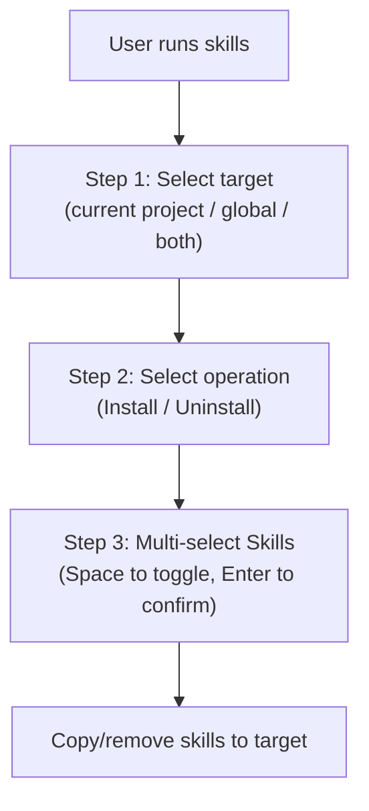

# Skill Management System

## Directory Layout

| Path | Role | Editable? |
|:-----|:-----|:----------|
| `skills/<name>/SKILL.md` | Skill source definitions (git-tracked) | Yes — this is the canonical source |
| `.agents/skills/<name>/` | Installed copies (project-local) | No — install output only |
| Global install path | Installed copies (user-wide) | No — install output only |

The `install_skill.sh` script (aliased as `skills`) copies from `skills/` to the selected target. Always edit `skills/<name>/SKILL.md`; never edit the installed copies.

## Interactive Installer Flow



## Workflow: Updating an Existing Skill

1. Edit source files in `skills/<skill_name>/`
2. Test locally or in target directory
3. Run `skills` and install to test

### Skill Sources (`SKILL_SOURCES`)

Configurable at the top of `install_skill.sh`:

```bash
SKILL_SOURCES=(
    "$DOTFILES_DIR/skills"
    "$github_dir/anth-skills/skills/skills"
    "$github_dir/matt-skills/skills/skills/engineering"
    "$github_dir/matt-skills/skills/skills/productivity"
)
```

The installer scans all configured source directories and presents a unified menu of available skills.

## Built-In Skills

Two skills are maintained in this repository under `skills/`:

| Skill | Purpose |
|:------|:--------|
| `mermaid-diagrams` | Guides Mermaid diagram generation in wiki pages with syntax safety rules |
| `write-connector` | Step-by-step instructions for adding OpenWiki source connectors |

Third-party skill quick-installs:

| Command | Effect |
|:--------|:-------|
| `matt` | Install Matt Pocock's skills via `npx skills@latest add mattpocock/skills` |
| `superpower` | Clone and copy `obra/superpowers` skills into `.agents/skills/` |

## Adding a New Skill

1. Create `skills/<name>/SKILL.md` with YAML front matter (`name`, `description`)
2. Include the full instructions in the Markdown body
3. Run `myskills` and install to test
4. Commit `skills/<name>/` to git

The skill loader in agent tools automatically discovers `SKILL.md` files under `.agents/skills/` at startup.

Source: [`install_skill.sh`](install_skill.sh), [`readme.md`](readme.md)
