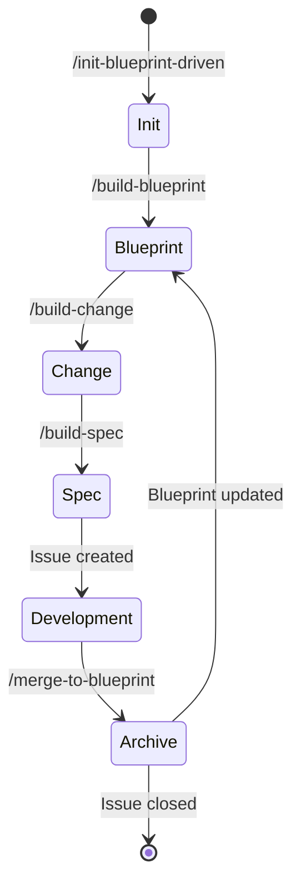

# Blueprint-Driven Development Workflow

A structured AI-assisted development methodology where product blueprints drive all coding work through a defined pipeline of five skill commands.

## Workflow Overview

| Skill Command | Phase | Purpose |
|:--------------|:------|:--------|
| `/init-blueprint-driven` | Setup | Configure issue tracker and global agent collaboration rules |
| `/build-blueprint` | Blueprint | Analyze code or interview user to generate/update `docs/blueprint.md` |
| `/build-change` | Change | Define single requirement change with A → B state diff in `docs/changes/` |
| `/build-spec` | Spec | Convert blueprint or change into actionable implementation spec, auto-create GitHub issue |
| `/merge-to-blueprint` | Archive | After development and acceptance, merge changes back into main blueprint, auto-close issue |

## State Transitions

## Key Artifacts

| Artifact | Path | Created By |
|:---------|:-----|:-----------|
| Product Blueprint | `docs/blueprint.md` | `/build-blueprint` |
| Change Definition | `docs/changes/<name>.md` | `/build-change` |
| Implementation Spec | Generated + GitHub issue | `/build-spec` |
| Project Notes | `docs/project.md` | `/init-blueprint-driven` (or code-to-blueprint) |
| Agent Domain | `docs/agents/domain.md` | `/init-blueprint-driven` |
| Issue Tracker Config | `docs/agents/issue-tracker.md` | `/init-blueprint-driven` |

## Project Notes Structure

`docs/project.md` captures repository-level facts: tech stack, file structure, workflow, and known pitfalls. It is generated when no blueprint exists yet and updated as the project evolves.

## Issue Tracker Integration

Issues and requirements live as GitHub issues. The `docs/agents/issue-tracker.md` defines conventions for creating, reading, listing, commenting, labeling, and closing issues via the `gh` CLI.

Source: [`readme.md`](readme.md), [`docs/project.md`](docs/project.md), [`docs/agents/issue-tracker.md`](docs/agents/issue-tracker.md)
